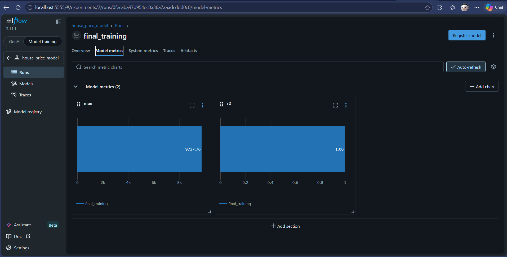
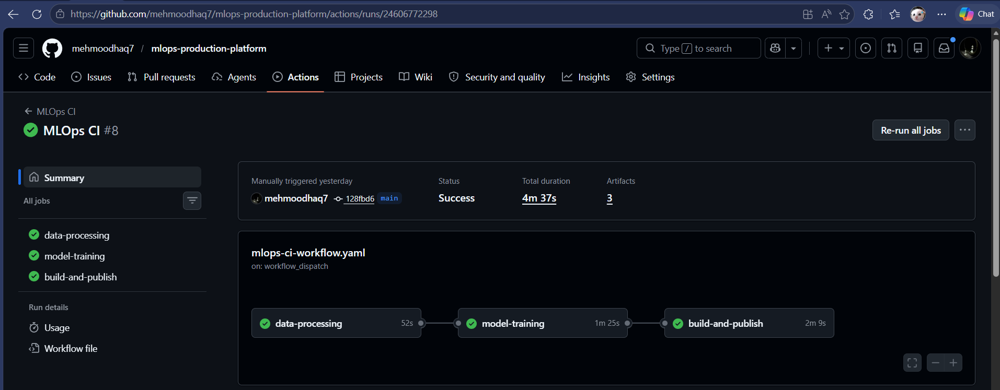
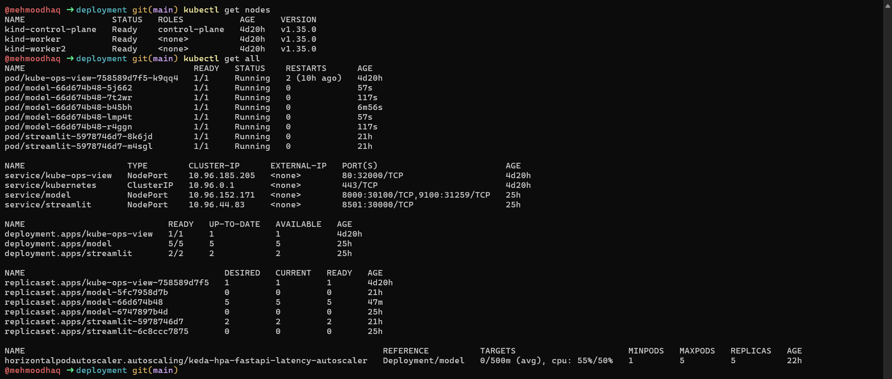
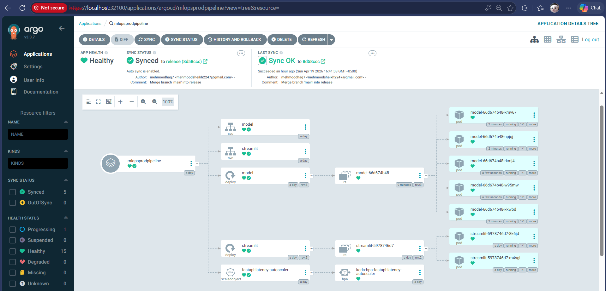
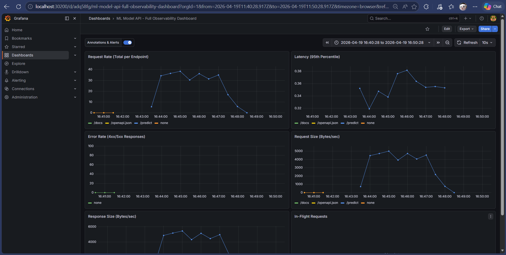
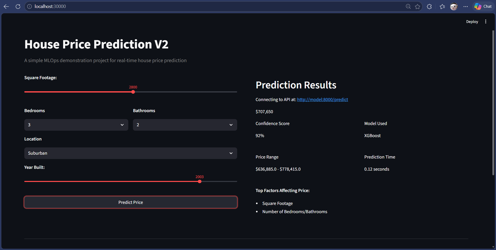
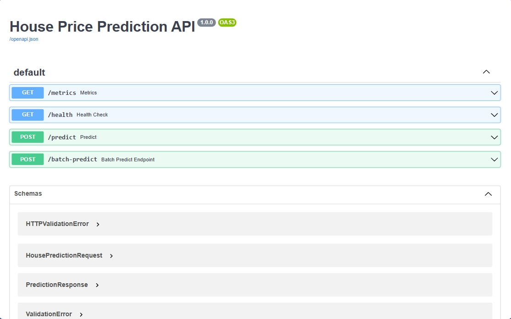

# House Price Predictor — MLOps Pipeline

An end-to-end MLOps project demonstrating the full ML lifecycle: from raw data and model experimentation to a containerized inference service with automated CI, GitOps-based deployment, and production-grade monitoring with autoscaling on Kubernetes.

---

## The Problem This Solves

Most ML models never reach production. The gap between a working notebook and a reliable, scalable inference service is where projects die. This project bridges that gap — taking a trained model through every stage of operationalization.

---

## Architecture

```
GitHub (main branch)
│
├── GitHub Actions CI
│ Data processing → Feature engineering → Model training (MLflow) → Docker build + push
│
└── Merge to release branch
│
ArgoCD (GitOps)
│
Kubernetes Cluster
├── FastAPI inference server (model + preprocessor baked in)
├── Streamlit frontend (DNS-based service discovery)
├── Prometheus + Grafana (custom FastAPI metrics dashboard)
└── KEDA autoscaling (p95 latency + request rate triggers)
```

---

## Stack

|             |                                       |
| ----------- | ------------------------------------- |
| ML          | Python, scikit-learn, XGBoost, MLflow |
| Serving     | FastAPI, Streamlit                    |
| Containers  | Docker, Docker Compose                |
| CI          | GitHub Actions                        |
| Kubernetes  | KIND, kubectl, Kustomize              |
| GitOps      | ArgoCD                                |
| Monitoring  | Prometheus, Grafana, Helm             |
| Autoscaling | KEDA, HPA, VPA                        |

---

## Project Structure

```
house-price-predictor/
├── argocd/                   # ArgoCD Application manifest
├── configs/                  # Model config (algorithm + hyperparameters)
├── data/
│   ├── raw/                  # Source CSV
│   └── processed/            # Pipeline output (generated)
├── deployment/
│   ├── kubernetes/           # K8s manifests (Deployments, Services, Kustomize)
│   ├── mlflow/               # Docker Compose for local MLflow
│   └── monitoring/           # ServiceMonitor, ScaledObject, VPA
├── models/trained/           # Serialized model + preprocessor (.pkl)
├── notebooks/                # EDA, feature engineering, experimentation
├── src/
│   ├── api/                  # FastAPI app (main, inference, schemas)
│   ├── data/                 # Data processing script
│   ├── features/             # Feature engineering script
│   └── models/               # Model training script
└── streamlit_app/            # Frontend + Dockerfile
```

---

## ML Pipeline

**Use case:** Predict house price from square footage, bedrooms, bathrooms, location, year built, and condition.

**Engineered features:** `house_age`, `price_per_sqft`, `bed_bath_ratio`

**Model selection:** Grid search with cross-validation across Linear Regression, Random Forest, Gradient Boosting, and XGBoost — tracked in MLflow. Gradient Boosting selected on R², MAE, RMSE.



The winning algorithm and hyperparameters are stored in `configs/model_config.yaml`. The training script reads this config — no experimentation code runs in production.

A fitted preprocessor is serialized with the model and applied at inference time, so the API accepts raw input without requiring clients to engineer features.

---

## CI Workflow (GitHub Actions)

Three modular jobs sharing artifacts between stages:

```
[data-processing]   →  cleaned data, preprocessor
[model-training]    →  trained model  (MLflow tracks runs in Docker sidecar)
[build-and-publish] →  Docker image validated via health check, pushed to DockerHub
                       tagged: short SHA + latest
```



Triggered on push to `main`. Supports `workflow_dispatch` for selective reruns.

---

## Kubernetes Deployment



Application deployed via Kustomize. ArgoCD tracks the `release` branch — any merge triggers automatic sync with `selfHeal` and `prune` enabled.



**Access points (KIND cluster):**

| Service      | URL                    |
| ------------ | ---------------------- |
| Streamlit    | `localhost:30000`      |
| FastAPI docs | `localhost:30100/docs` |
| Grafana      | `localhost:30200`      |
| Prometheus   | `localhost:30300`      |

---

## Monitoring & Autoscaling



FastAPI is instrumented and metrics are served on a **dedicated port (9100)**, isolated from the prediction workload on port 8000. This prevents metric scraping failures under load.

KEDA ScaledObject triggers horizontal scale-out when:

- p95 latency exceeds **80ms**
- Request rate exceeds **20 req/s**

VPA adjusts pod resource requests dynamically based on observed usage, so scaled-out pods are properly sized from the start.

---

## Inference




